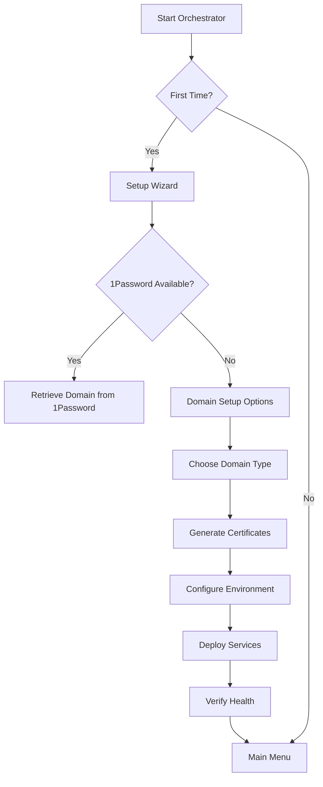

# 🎼 Carian Observatory Orchestrator System Design

## 🎯 Vision Statement

A single, unified orchestrator script that provides complete platform management with an intuitive dashboard interface, supporting both experienced users with custom domains and newcomers using localhost deployments.

## 🏗️ Architecture Overview

```
┌─────────────────────────────────────────────────────────┐
│                  orchestrator.sh                        │
│            (Main Entry Point & Menu System)             │
└────────────────────┬────────────────────────────────────┘
                     │
     ┌───────────────┼───────────────┬────────────────┐
     ▼               ▼               ▼                ▼
┌─────────┐    ┌──────────┐    ┌──────────┐    ┌──────────┐
│  Setup  │    │Dashboard │    │ Services │    │  Utils   │
│ Wizard  │    │  Module  │    │  Control │    │  Module  │
└─────────┘    └──────────┘    └──────────┘    └──────────┘
     │               │               │                │
     ▼               ▼               ▼                ▼
 First-Time    Status Display   Start/Stop      Backup/SSL
 Domain Setup  Health Checks    Restart         Maintenance
 Cert Manager  Resource Mon.    Logs            Updates
```

## 📋 Core Components

### 1. Main Orchestrator (`orchestrator.sh`)

```bash
#!/bin/bash

# Main orchestrator script with interactive menu
# Features:
# - Auto-detects first-time setup
# - Interactive menu system
# - Status dashboard display
# - Modular script integration

# Key Functions:
main_menu()           # Display main menu options
first_time_check()    # Detect if first-time setup needed
load_modules()        # Load all orchestrator modules
display_dashboard()   # Show status dashboard
handle_user_input()   # Process menu selections
```

### 2. Setup Wizard Module

#### Domain Configuration Logic
```bash
# Domain Setup Flow
1. Check 1Password for existing domain
   ├─ Found → Use existing domain
   └─ Not Found → Offer alternatives:
       ├─ Enter custom domain
       ├─ Use localhost domain (*-carian-observatory.local)
       └─ Use IP-based access (192.168.x.x)

# Localhost Domain Setup
- Pattern: {service}-carian-observatory.local
- Auto-generate /etc/hosts entries:
  127.0.0.1 auth-carian-observatory.local
  127.0.0.1 webui-carian-observatory.local
  127.0.0.1 perplexica-carian-observatory.local
```

#### Certificate Management
```bash
# Certificate Generation Strategy
if [[ "$DOMAIN_SOURCE" == "1password" ]]; then
    ./scripts/certificates/deploy-certificates.sh
elif [[ "$DOMAIN_SOURCE" == "localhost" ]]; then
    # Generate self-signed certificates
    for service in auth webui perplexica; do
        openssl req -x509 -newkey rsa:2048 \
            -keyout "$SSL_DIR/${service}-carian-observatory.local.key" \
            -out "$SSL_DIR/${service}-carian-observatory.local.crt" \
            -days 365 -nodes \
            -subj "/CN=${service}-carian-observatory.local"
    done
fi
```

### 3. Dashboard Module

#### Visual Status Display
```bash
# Dashboard Components
show_service_status()    # Display container health
show_resource_usage()    # CPU/Memory/Disk metrics
show_domain_info()       # Current domain configuration
show_ssl_status()        # Certificate validity
show_recent_logs()       # Last 5 log entries per service
```

#### Real-time Updates
```bash
# Update mechanism
while true; do
    clear
    display_dashboard
    read -t 5 -n 1 user_input  # 5-second refresh rate
    [[ -n "$user_input" ]] && handle_menu_selection "$user_input"
done
```

### 4. Service Control Module

```bash
# Service Management Functions
start_all_services()     # docker compose up -d
stop_all_services()      # docker compose down
restart_service()        # Smart restart with dependencies
view_logs()             # Tail logs with service selection
health_check()          # Comprehensive health verification
```

## 🚀 First-Time Setup Flow



## 💻 User Interface Design

### Main Menu
```
╔════════════════════════════════════════════════╗
║     🎯 Carian Observatory Orchestrator         ║
╠════════════════════════════════════════════════╣
║                                                 ║
║  Main Menu:                                    ║
║                                                 ║
║  [1] 📊 Status Dashboard                       ║
║  [2] 🚀 Start All Services                     ║
║  [3] 🛑 Stop All Services                      ║
║  [4] 🔄 Restart Service                        ║
║  [5] 📝 View Logs                              ║
║  [6] 💚 Health Check                           ║
║  [7] 🔐 Authentication Management              ║
║  [8] 🔑 1Password Management                   ║
║  [9] 🛠️  Advanced Settings                     ║
║  [0] 📚 Documentation                          ║
║                                                 ║
║  [Q] Quit                                      ║
║                                                 ║
╚════════════════════════════════════════════════╝

Enter selection: 
```

### First-Time Setup Wizard
```
╔════════════════════════════════════════════════╗
║        🎉 Welcome to Carian Observatory        ║
╠════════════════════════════════════════════════╣
║                                                 ║
║  Let's get your platform set up!              ║
║                                                 ║
║  Step 1: Domain Configuration                  ║
║  ─────────────────────────────                ║
║                                                 ║
║  How would you like to configure domains?      ║
║                                                 ║
║  [1] 🔐 Use 1Password (Recommended)           ║
║  [2] 🌐 Enter Custom Domain                    ║
║  [3] 🏠 Use Localhost Domain                   ║
║  [4] 📡 Use IP Address                         ║
║                                                 ║
║  Choice: 3                                     ║
║                                                 ║
║  ✅ Localhost domain selected!                 ║
║  Domain pattern: *-carian-observatory.local    ║
║                                                 ║
║  [Enter] Continue  [B] Back  [Q] Quit         ║
║                                                 ║
╚════════════════════════════════════════════════╝
```

## 🔧 Implementation Details

### Environment Detection
```bash
# Detect platform capabilities
detect_environment() {
    # Check for 1Password CLI
    HAS_1PASSWORD=$(command -v op >/dev/null && echo "true" || echo "false")
    
    # Check for Docker
    HAS_DOCKER=$(command -v docker >/dev/null && echo "true" || echo "false")
    
    # Check for existing configuration
    HAS_CONFIG=[[ -f .env ]] && echo "true" || echo "false"
    
    # Detect OS
    OS_TYPE=$(uname -s)
    
    # Check network connectivity
    CAN_REACH_INTERNET=$(ping -c 1 google.com >/dev/null 2>&1 && echo "true" || echo "false")
}
```

### Modular Script Integration
```bash
# Script discovery and loading
load_scripts() {
    # Authentication scripts
    source scripts/authentication/functions.sh
    
    # Infrastructure scripts
    source scripts/infrastructure/functions.sh
    
    # 1Password scripts
    source scripts/onepassword/functions.sh
    
    # Certificate scripts
    source scripts/certificates/functions.sh
}
```

### Error Handling & Recovery
```bash
# Graceful error handling
handle_error() {
    local error_code=$1
    local error_message=$2
    
    echo "❌ Error: $error_message"
    
    case $error_code in
        1) suggest_recovery "docker_not_running" ;;
        2) suggest_recovery "1password_auth_failed" ;;
        3) suggest_recovery "certificate_generation_failed" ;;
        *) suggest_recovery "generic" ;;
    esac
}
```

## 🎨 ADHD-Friendly Features

### Visual Enhancements
- **Color coding**: Green for success, yellow for warning, red for errors
- **Progress bars**: Visual feedback for long operations
- **Emoji indicators**: Quick visual scanning of status
- **Clear hierarchy**: Indented structure for related items

### Interaction Design
- **Single-key navigation**: Quick menu selections
- **Auto-refresh dashboard**: No manual refresh needed
- **Contextual help**: [?] key shows help for current screen
- **Undo support**: Ability to reverse recent actions

### Cognitive Load Reduction
- **Guided workflows**: Step-by-step wizards
- **Smart defaults**: Pre-selected common options
- **Minimal choices**: Max 9 options per menu
- **Clear feedback**: Every action has visible result

## 📊 Status Dashboard Components

### Service Health Indicators
```
✅ Running (healthy)     - All health checks passing
⚠️  Running (unhealthy)  - Service up but checks failing
🔄 Restarting           - Container restart in progress
⏸️  Paused              - Container paused
❌ Stopped              - Container not running
🔧 Maintenance          - Planned maintenance mode
```

### Resource Monitoring
```bash
# CPU Usage Bar
CPU:  ████████░░░░░░░░ 47% (4 cores)

# Memory Usage Bar  
MEM:  ██████████████░░ 82% (13.1GB/16GB)

# Disk Usage Bar
DISK: ████░░░░░░░░░░░░ 23% (46GB/200GB)
```

## 🔐 Security Considerations

### Domain Security
- **Self-signed certificates**: Include security warning for localhost
- **Certificate validation**: Check expiry dates on dashboard
- **HTTPS enforcement**: No HTTP access to services

### Access Control
- **Local-only binding**: Localhost domains only accessible locally
- **Firewall rules**: Automatic firewall configuration for services
- **Authentication required**: All services behind Authelia

## 📦 Deliverables

### Phase 1: Core Orchestrator
- [ ] Main orchestrator.sh script
- [ ] Interactive menu system
- [ ] Module loading framework
- [ ] Basic status display

### Phase 2: Setup Wizard
- [ ] First-time detection
- [ ] Domain configuration
- [ ] Certificate generation
- [ ] Environment setup

### Phase 3: Dashboard
- [ ] Service status display
- [ ] Resource monitoring
- [ ] Real-time updates
- [ ] Log viewer

### Phase 4: Advanced Features
- [ ] Backup/restore functionality
- [ ] Update management
- [ ] Performance tuning
- [ ] Custom configurations

## 🎯 Success Criteria

1. **Single command deployment**: `./orchestrator.sh` starts everything
2. **Zero-config option**: Works with localhost domains out of box
3. **Visual feedback**: Clear status at all times
4. **Error recovery**: Graceful handling of all failure modes
5. **ADHD-friendly**: Minimal cognitive load, maximum visual clarity

## 🔗 Related Documentation
- [Future Development TODO](FUTURE_DEVELOPMENT_TODO.md)
- [Infrastructure Scripts](../scripts/infrastructure/README.md)
- [Authentication Scripts](../scripts/authentication/README.md)
- [Main README](../README.md)